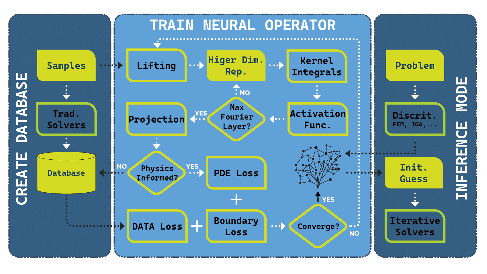
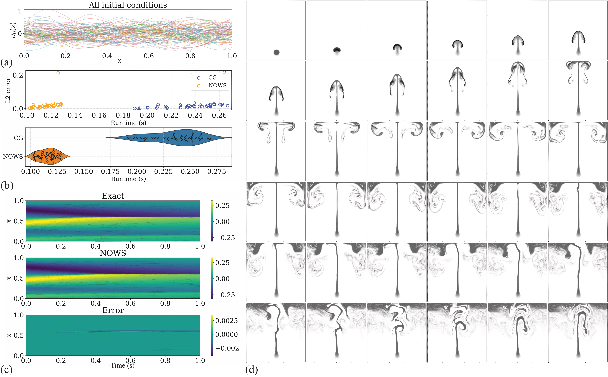

# NOWS: Neural Operator Warm Starts

This repository accompanies the paper:

**NOWS: Neural Operator Warm Starts for Accelerating Iterative Solvers**

---

## Overview

**Neural Operator Warm Starts (NOWS)** is a hybrid framework that accelerates classical numerical PDE solvers — such as Conjugate Gradient (CG) and GMRES — by using *neural operators* (e.g., FNO, DeepONet, VINO) to generate high-quality initial guesses.  
This reduces solver iterations and overall runtime while keeping the solver’s **stability**, **robustness**, and **convergence guarantees** fully intact.

NOWS is **solver-agnostic** and **discretization-agnostic**, integrating seamlessly with:
- Finite Element Method (FEM)
- Finite Difference Method (FDM)
- Isogeometric Analysis (IGA)
- Finite Volume Method (FVM)

Across diverse PDEs (Poisson, Darcy, Burgers, elasticity, Navier–Stokes), NOWS consistently achieves **25–90% runtime reduction**, demonstrating strong generalization across geometries, resolutions, and physical systems.

---
## NOWS framework (high-level)

<p align="center">
  
</p>

*Workflow concept:*  
Neural operator → produces an initial guess → classical solver only needs to do the *fine* iterations → same accuracy, much lower cost.

<p align="center">
  
</p>

---

## Repository status

The **code and data will be made publicly available after the journal review process is complete.**

👉 **Please ⭐ star this repository** to get notified automatically when the public release is published.

---

## Abstract (summary)

Partial differential equations (PDEs) are the foundation of computational science and engineering, yet high-fidelity simulations remain computationally demanding.  
NOWS introduces a hybrid paradigm that leverages neural operator predictions to warm-start traditional iterative solvers.  
The neural operator rapidly provides an accurate initial guess, and the classical solver completes convergence.  
This hybridization achieves substantial speed-ups (up to 90%), retains full accuracy, and is compatible with any existing solver infrastructure.  
By combining the rapid inference of learned operators with the rigor of numerical solvers, NOWS offers a practical and trustworthy path toward accelerating high-fidelity PDE simulations.

---

## Key features

- 🚀 **Acceleration:** Reduces iteration count and runtime by up to 90%.
- 🧠 **Physics-consistent learning:** Can use data-driven, physics-informed, or hybrid training.
- ⚙️ **Solver-agnostic:** Works with CG, GMRES, and other Krylov or multigrid methods.
- 🧩 **Discretization-independent:** Supports FEM, FDM, IGA, and FVM backends.
- 🗺️ **Generalization:** Robust to mesh refinement, geometry variation, and PDE type.
- 🧮 **No modification needed:** Integrates directly with existing solvers.

---

## Project structure (will be available upon release)

NOWS/

│

├── nows/                  # Core implementation

│   ├── models/            # Neural operator architectures (FNO, VINO, etc.)

│   ├── solvers/           # Interfaces to iterative solvers (CG, GMRES, ...)

│   ├── utils/             # Helper functions and data utilities

│   └── training/          # Physics-informed and data-driven training scripts

│

├── experiments/           # Reproducible benchmark setups

│   ├── poisson/

│   ├── darcy/

│   ├── elasticity/

│   ├── burgers/

│   └── smoke_plume/

│

├── data/                  # Sample or synthetic datasets

│

├── notebooks/             # Interactive demos

│

├── results/               # Plots, figures, and numerical comparisons

│

├── LICENSE

├── README.md

└── requirements.txt


## Contact

For questions or collaboration inquiries:

- **Mohammad Sadegh Eshaghi** — eshaghi.khanghah@iop.uni-hannover.de  
- **Cosmin Anitescu** — cosmin.anitescu@uni-weimar.de  

---

## Acknowledgments

The authors acknowledge the support of:

- The **German Academic Exchange Service (DAAD)**
- The **Compute Servers of TU Ilmenau** for providing computational resources.
- 
## Paper citation

If you use or refer to this work, please cite:

```bibtex
@article{Eshaghi2025NOWS,
  title={Neural Operator Warm Starts for Accelerating Iterative Solvers},
  author={Eshaghi, Mohammad Sadegh and Anitescu, Cosmin and Valizadeh, Navid and Wang, Yizheng and Zhuang, Xiaoying and Rabczuk, Timon},
  year={2025},
  journal={...}
}
